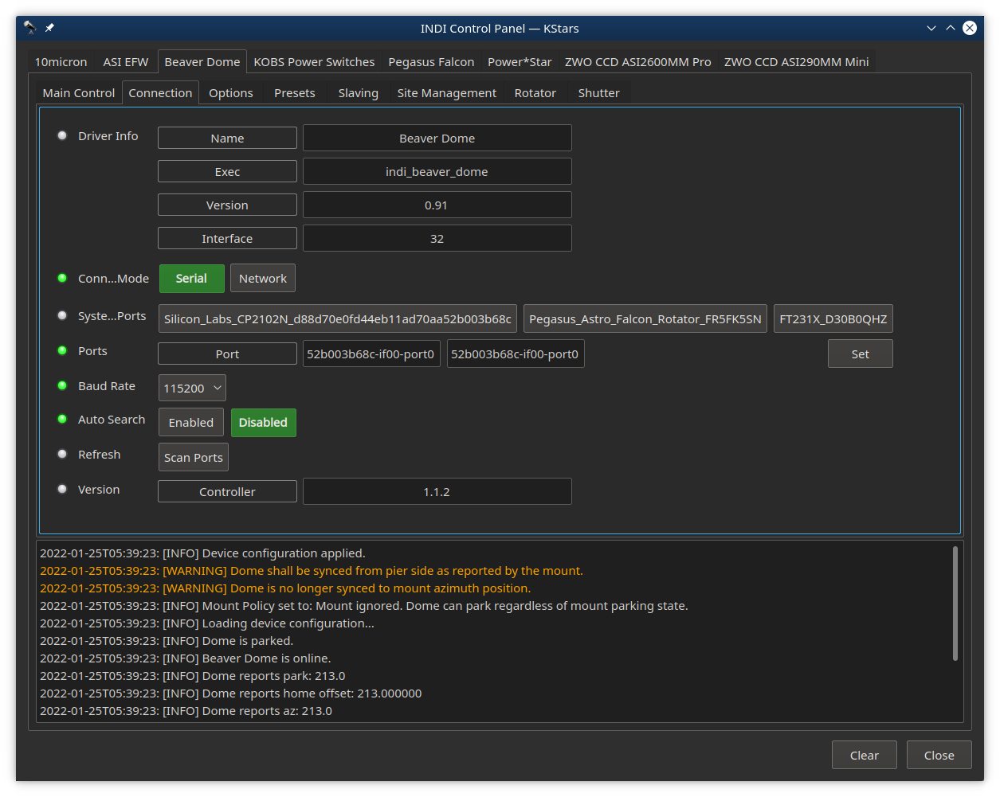
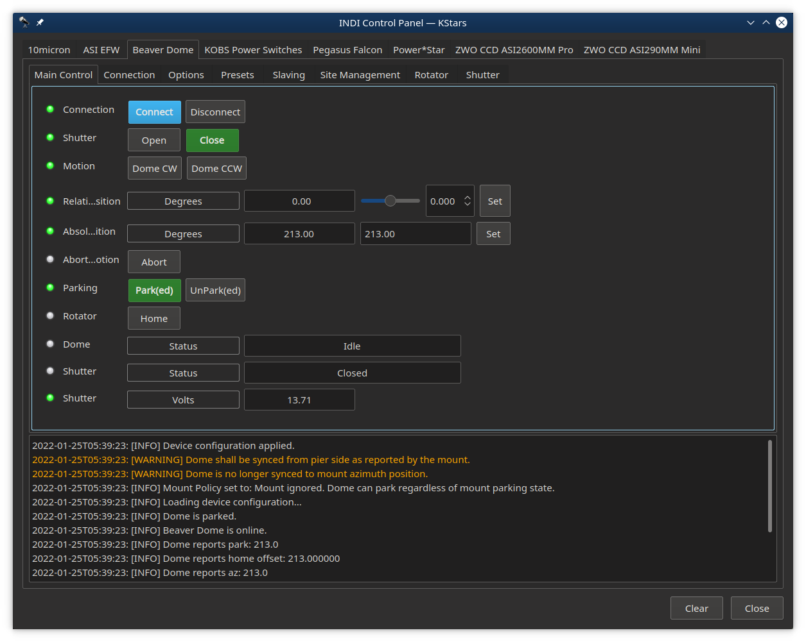
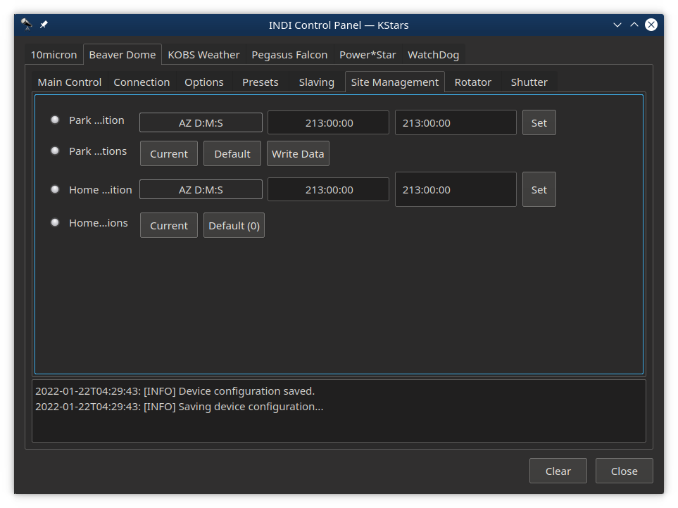

Lunatico NexDome Beaver INDI Driver
=========================================
This package provides the INDI driver for Lunatico NexDome Beaver controller.

NexDome is a classic observatory dome with more than 100 degrees of shutter opening, allowing you to point your telescope to the zenith while remaining shielded from stray light and wind. The 2.2 meter inside diameter provides plenty of space to operate up to a 14” Schmidt Cass or a refractor 1400mm long.

The driver is compatible with Beaver firmware version 1.0 or higher.

INDI NexDome Beaver driver is currently only released in beta form from a separate git repository. It is compatible with libindi >= v1.8.2

ALERTS
======
20220121 Version 0.8

Read the Release Notes.

Status Overview:
- Network connection has not been tested yet, use USB or let me know if it works for you.
- The controller does not support setting the shutter timeout value.
- Aborting while the shutter is in motion will stop the shutter, however the controller will issue hardware errors.  Simply close or open the shutter to continue.
- Use the MSWindow's based [Beaver software utility](https://www.nexdome.com/resources) to:
  - Set IP address if you want to use the network
  - Update the firmware
  - Reset rotator or shutter low level settings

INSTALL
=======
- Reference the INSTALL document.

FEATURES
========
NexDome is a fully automatic observatory dome control system. Link your dome to a computer for complete automation including telescope slaving and shutter control. It supports the following features:

    Slave dome rotation to your telescope
    Rotation-only and full shutter-and-rotation available
    Dome and Shutter status
    Rotator homing and park
    Motor control (Mmx/min speeds, acceleration and timeouts)
    Direct confirmation of shutter open/closed state
    Slave dome rotation to your telescope
    Failsafe feature for shutter on low battery, disconnection with controller or computer
    Park-before-close option to avoid mechanical interferences
    Manual override controls for shutter and rotation control
    (Not implemented yet) Field-upgradable firmware (You will need to use the Window's Beaver configuration utility atm)

How to Use
==========

You can use the driver in any INDI-compatible client (such as KStars or Xephem) - just select 
Beaver from the Dome list

To run the driver from the command line:

$ indiserver indi_beaver # plus other needed drivers (telescope, camera, etc)

or using the indiwebserver.

You can then connect to the driver from any client, the default port is 7624.
If you're using KStars, the drivers will be automatically listed in KStars' Device Manager.

Before you Start
================

- Shutter controls will not show unless the rotator unit is in communication with the shutter unit.
  - This can take up to 20 secs after turning on the shutter
- Under the Slaving tab: you need to set the parameters for your dome:
  - (Reference the Slaving Tab below)
- Set the Park and Home positions
  - (Reference the Site Management Tab below)
- Initialize the rotator and shutter
  - (Reference both the Rotator and Shutter tabs)
- Do monitor the shutter battery field (see Main tab)

OPERATIONS
==========

Connection Tab
--------------

You can connect to the Beaver controller via Serial (USB) or Network

USB:
- Look for Silicon_Labs_CP2102N_USB_to_UART_Bridge_Controller_d88d70e0fd44eb11ad70aa52b003b68c-if00-port0 
  - idVendor=10c4, idProduct=ea60 (On linux run: lsusb)
- BaudRate 115200

Network:
- I am having a problem connecting to the controller, so this is not tested.  Let me know if this works for you.
- Currently you would have to use the Window's [Beaver software utility](https://www.nexdome.com/resources) tool to set the IP address.
- Port should be 10000
- Connection type is UDP

The INDI driver version is listed under Driver Info (that's this software)

Beaver controller's firmware version is listed on the Beaver line.

Main Tab
--------

Shutter Open/Close will only show up if the Shutter controller is up and communicating with the Rotator controller.

Move Relative buttons are meant to start/stop motion.  However, instead they move the dome by the amount set by the relative amount set in t he field above.  As a result, you need to press the CW or CCW button twice (once to start, once to stop).

Absolute Position will move the dome AZ relative to what you set the Home Offset to, which if set according to the instruction in the Rotator Tab, this will be from true north.

Dome and Shutter Status fields will display any errors, idle, moving, etc.

The Shutter Volts field displays the current voltage of the shutter battery.  In combination with the Safe Voltage on the Shutter tab, this can trigger the rotator controller to go into safety mode and call for the shutter to close.
- Shutter Volts and Status fields will not show if the shutter controller is off or not in communication.

Options Tab
-----------

You can enable or disable automatic shutter opening and closing when dome goes to into or out of the Park position. After changing these settings, click 'Save configuration' button to save the driver settings.

Mount Policy: Mount policy can be either set to Ignore Telescope (default) or Telescope Locks. When the policy is set to Ignore Telescope then the dome can park/unpark regardless of the mount parking state. When it is set Telescope locks, this disallows the dome from parking when telescope is unparked, and can lead to damage to hardware if it rains.  

Site Management Tab
-------------------

Park position can be set anywhere. Usually this is set to where the shutter charger is located, so the shutter will be charging when parked.
There are four options for setting the park position:
  - Set the 'Park Position' field by entering the degrees, minutes and seconds of the offset from the home magnet to north
  - Move the dome to where you want and click 'Current'
  - 'Default' button sill set park to zero
  - 'Write Data' button will force a write to ~/.indi/ParkData.xml file which is read on startup

Note: clicking on 'Park' will move to the park position and also prevent any rotator movement/action, until UnPark is clicked.

Home is defined as where the rotator controller's index magnet is located.  This can be anywhere convenient (like not by the door, over a bay, etc.).  Setting the Home Position field will correctly index this from north.
There are three options to set the home position(Home ...ition).
  - Set the 'Home Position' field by entering the degrees, minutes and seconds of the offset from the home magnet to north
  - Move the dome to the home magnet sensor and click 'Current'
  - 'Default' button will set the offset to zero
  
Slaving Tab
-----------

You can slave the dome to the mount by setting the required slaving parameters (by convention the units are in meters);

- Radius is for the radius of the dome (typically 2.2 for a Nexdome)
- Shutter width is the aperture of the shutter of the dome in meters (0.6m in current models)
- N displacement is for north-south displacement of the intersection of the RA & DEC axis as measured from the center of the dome. Displacement to north is positive, and to south is negative.
- E displacement is for east-west displacement. Similar as the above, displacement to east are positive, and to west are negative.
- Up displacement is for displacement of the RA/DEC intersection in the vertical axis as measured from the origin of the dome (not the walls). Up is positive, down is negative.
- OTA offset is for the distance of the optical axis to the RA/DEC intersection. In fork mount this is generally 0, but for German like mounts is the distance from mount axis cross to the center line of the telescope. West is positive, east is negative.

After settings the parameters above, go to Options tab and click Save in Configurations so that the parameters are used in future sessions. You can also set the Autosync threshold which is the minimum distance autosync will move the dome. Any motion below this threshold will not be triggered. This is to prevent continuous dome moving during telescope tracking.

+ [See Reference for more infomation on these settings - scroll to the bottom](https://www.nexdome.com/_files/ugd/8a866a_9cd260bfa6de414aacdc7a9e26b0a607.pdf)
  
Rotator Tab
-----------

- Click on the 'Measure Home' button to initialize the rotator.  This will
  find and measure the home sensor on the rotator and set all the parameters.
- The 'Find Home' button will find the home sensor then calculate and set all the max/min/acceleration/timeout settings
  - You should not change these unless you really know what you are doing!
  - If either the rotator or shutter unit is turned off (zero values for the max/min, etc), you should redo the home procedures
  - To reset the rotator parameters back to defaults, click the 'Measure Home' button
- To Park or unPark the dome or goto Home, see the Main tab

After settings the parameters above, go to Options tab and click Save in Configurations so that the parameters are used in future sessions.

Shutter Tab
-----------

- NOTE:  This tab will not show up unless the rotator controller is communicating with the shutter
  - When turning the shutter power on, it can take up to 20 seconds for communication to be established
- The 'AutoCalibrate' button will exercise the shutter through it's full range from closed to open.  It will then set all these fields appropriately.
  - You really should not change these unless you know what you are doing!
- If these values are zero, click on the 'AutoCalibrate' button to initialize them
- Safe Voltage is the level at which the rotator will execute it's shutter safety proceedure and close the shutter.
- To open or close the shutter, see the Main Tab.

To enable or disable automatic shutter opening and closing when dome goes to into or out of the Park position, see the Options Tab.

After settings the parameters above, go to Options tab and click Save in Configurations so that the parameters are used in future sessions.

Presets Tab
-----------

Allows you to set 3 rotator positions for convenient locations of your dome.
- Example, maybe you need a ladder to access the dome or shutter for maintenance.  One preset could rotate the dome so that's it's more convenient.

ISSUES
============
- Reference the Release Notes (above)

